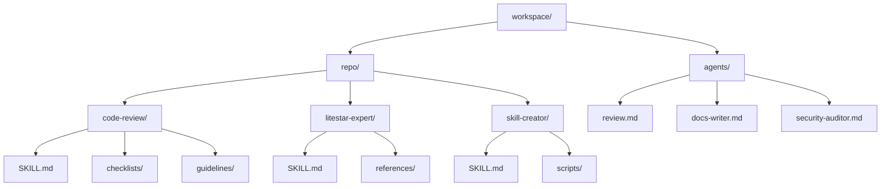
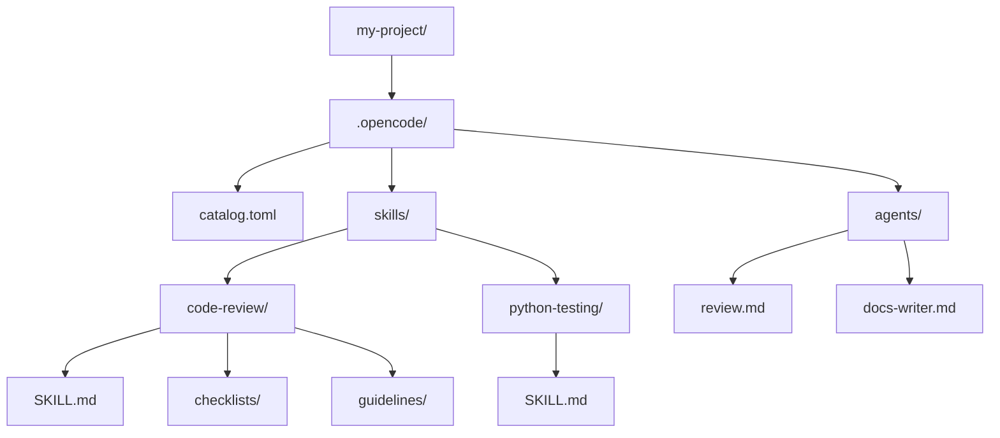
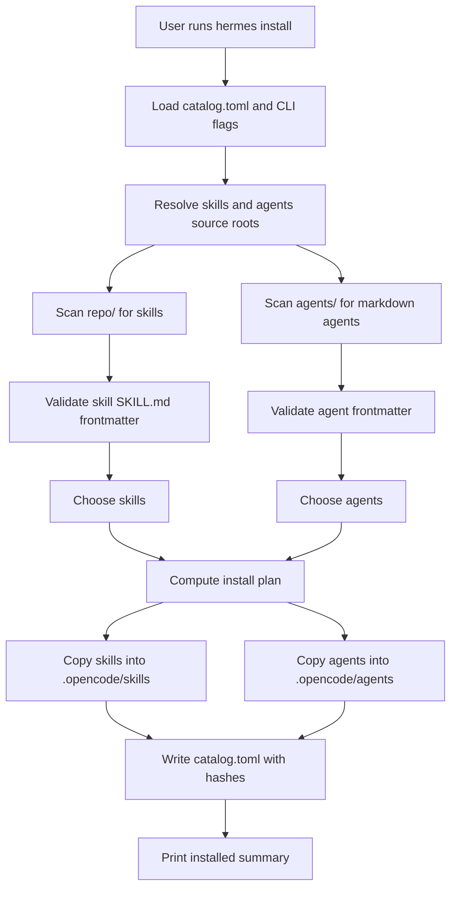
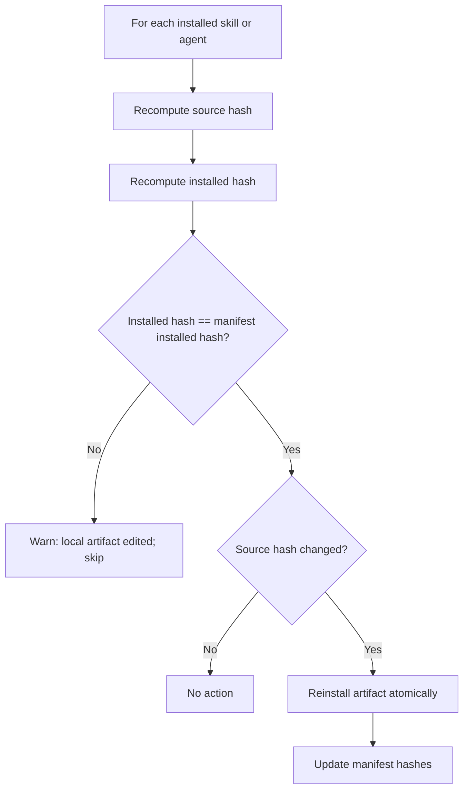
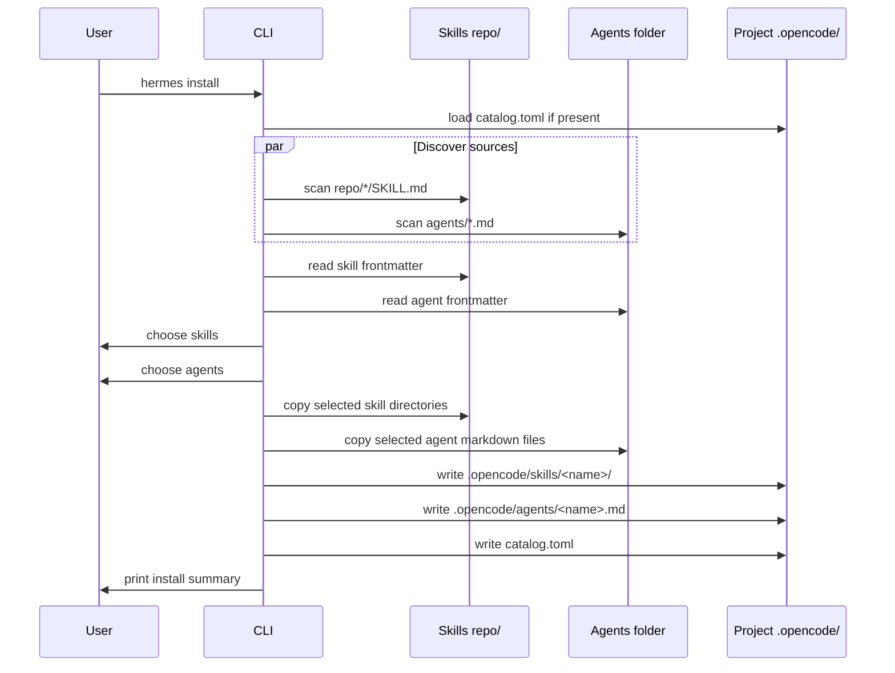

# Hermes: Rust OpenCode Installer CLI

## Summary

Build `hermes`, a Rust CLI that treats:

- `repo/` as the source of reusable skills
- `agents/` as the source of reusable OpenCode agents

Hermes should install a selected subset of both into a project-local `.opencode/` directory:

- skills into `.opencode/skills/`
- agents into `.opencode/agents/`

Hermes should default to copying artifacts, preserve skill resources, copy agent markdown files verbatim, and maintain a single local manifest so the project can later list, sync, update, or remove installed skills and agents safely.

## Name

`hermes` is named after the Greek messenger god associated with travel, boundaries, and exchange.

That maps directly to the CLI's job:

- move curated skills and agents from a shared source library into a project-local workspace
- bridge the boundary between central reusable assets and project-specific `.opencode/` state
- keep those installed copies manageable through list, sync, remove, and doctor operations

## Problem

Today your reusable skills live centrally in `repo/`, and you want each new project to install only the skills it needs.

You also want to curate reusable OpenCode agents in a new top-level `agents/` folder, then import selected agents into the local project `.opencode/agents/` directory.

Based on the OpenCode agents docs:

- project-specific agents live in `.opencode/agents/`
- agents are markdown files with YAML frontmatter plus a markdown body
- the markdown filename becomes the agent name
- `description` is required
- `permission` is preferred over deprecated `tools`

## Source Layout

See `docs/sample-agents-library.md` for a concrete proposed `agents/` library layout and sample agent files.



## Installed Project Layout



## Goals

- Discover available skills by scanning `repo/`.
- Discover available agents by scanning `agents/`.
- Validate that each skill contains a `SKILL.md` file.
- Validate that each agent is a markdown file with valid frontmatter.
- Parse skill frontmatter from `SKILL.md` and surface `name` and `description` in the CLI.
- Parse agent frontmatter and surface `description` and `mode` in the CLI.
- Let the user choose skills and agents interactively or pass names directly.
- Install selected skills into `.opencode/skills/<skill-name>/`.
- Install selected agents into `.opencode/agents/<agent-name>.md`.
- Preserve skill bundled resources like `references/`, `scripts/`, `checklists/`, `guidelines/`, and `assets/`.
- Track installed skills and agents in a local manifest so later operations are deterministic.
- Support re-running the command without duplicating or corrupting installed content.

## Non-Goals

- Editing skill contents.
- Editing agent prompts or frontmatter during install.
- Publishing skills or agents to a remote registry.
- Merging user-edited local skills or agents automatically.
- Generating new agents from natural language prompts. OpenCode already has `opencode agent create` for that workflow.
- Supporting multi-file agents with external `{file:...}` prompt references in v1.

## Recommended CLI Surface

Working binary name: `hermes`

```bash
# Configure global source roots (one-time setup)
hermes configure --skills-source ~/Projects/opencode-skills/repo --agents-source ~/Projects/opencode-skills/agents

# Initialize a project workspace (creates .opencode/ directory)
hermes init

# Install artifacts (no prior init required if source roots are configured)
hermes install
hermes install --skills code-review python-testing --agents review security-auditor
hermes install skills code-review python-testing
hermes install agents review security-auditor

# List and manage artifacts
hermes list --available skills
hermes list --available agents
hermes list --installed all
hermes sync --all
hermes remove skills code-review
hermes remove agents review
hermes doctor
```

## Command Behavior

### `configure`

- Creates `~/.config/hermes_cli/` and writes `config.toml` with the provided source roots.
- Allows either source root to be omitted, but requires at least one of `--skills-source` or `--agents-source`.
- Updates existing config without clearing unspecified roots.
- This is the recommended way to set up persistent source root configuration.

### `init`

- Creates `.opencode/`, `.opencode/skills/`, and `.opencode/agents/` if missing.
- Creates `.opencode/catalog.toml` for tracking installed artifacts.
- Does not install anything yet.
- Source roots are resolved from CLI flags, user config (`~/.config/hermes_cli/config.toml`), or environment variables.

### `install`

- Discovers skills from the configured skills source root, if present.
- Discovers agents from the configured agents source root, if present.
- If no names are provided and running in an interactive terminal, opens a full-screen TUI for selecting skills and agents (see [Interactive Install TUI](#interactive-install-tui)).
- If no names are provided and running in a non-TTY environment, fails with a clear error.
- Copies chosen skills into `.opencode/skills/`.
- Copies chosen agents into `.opencode/agents/`.
- Updates `.opencode/catalog.toml`.
- Refuses to overwrite a locally modified installed skill or agent unless `--force` is passed.
- **Note**: Does not require a prior `hermes init` if source roots are configured via `hermes configure` or environment variables.

### `list`

- `--available skills`: shows skills discoverable from the skills source root.
- `--available agents`: shows agents discoverable from the agents source root.
- `--installed all`: shows all installed skills and agents in the current project.

### `sync`

- Reconciles installed skills and agents with the source roots recorded in the manifest.
- Updates installed copies when the source content changed.
- Warns and skips an artifact if the local installed copy was edited manually.

### `remove`

- Removes `.opencode/skills/<name>/` for skills.
- Removes `.opencode/agents/<name>.md` for agents.
- Removes the corresponding entry from the manifest.

### `doctor`

- Verifies the configured source roots exist.
- Verifies installed skills still contain valid `SKILL.md` files.
- Verifies installed agents still contain valid frontmatter.
- Verifies manifest entries line up with files on disk.
- Reports unsupported v1 agent patterns like frontmatter `prompt: {file:...}`.

## Path Resolution

Use the current working directory as the default project root.

- Project `.opencode` path: `<cwd>/.opencode`
- Installed skills path: `<cwd>/.opencode/skills`
- Installed agents path: `<cwd>/.opencode/agents`
- User config path: `~/.config/hermes_cli/config.toml`

Resolve each source root independently in this order:

1. CLI flag (highest precedence)
2. User config file (`~/.config/hermes_cli/config.toml`)
3. Environment variable (lowest precedence)

Environment variables:

- `OPENCODE_SKILLS_SOURCE`
- `OPENCODE_AGENTS_SOURCE`

Behavior when a source root is missing:

- If a command explicitly requests that kind, fail with a clear error.
- If a command is operating on all kinds, skip the missing kind and print a note.

## Install Flow



## Filesystem Rules

### Skill Discovery

Treat every direct child of `repo/` as a candidate skill directory.

A directory is a valid skill if:

- It contains `SKILL.md` at the top level.
- `SKILL.md` has YAML frontmatter.
- Frontmatter contains `name` and `description`.
- `name` matches the directory name.

If any of these checks fail, skip the skill and report it in `doctor`.

### Agent Discovery

Treat every direct child markdown file under `agents/` as a candidate agent.

A file is a valid agent if:

- It ends with `.md`.
- It has YAML frontmatter at the top of the file.
- Frontmatter contains `description`.
- `mode`, if present, is one of `primary`, `subagent`, or `all`.
- The filename stem is the installed agent name.

For v1, reject and report agents that use `prompt: {file:...}` in frontmatter. The installer should only support standalone markdown agents whose prompt body lives in the same file.

### Skill Copy Rules

Copy the full skill directory recursively, including nested resource folders.

Preserve:

- `SKILL.md`
- `references/**`
- `scripts/**`
- `assets/**`
- `checklists/**`
- `guidelines/**`
- any other project-authored files that belong to the skill

Ignore during copy and hashing:

- `.DS_Store`
- `**/__pycache__/**`
- `**/*.pyc`
- `**/.git/**`
- `**/node_modules/**`

The ignore list should stay small and only exclude obvious generated junk.

### Agent Copy Rules

Copy the agent markdown file verbatim into `.opencode/agents/`.

Preserve:

- the full YAML frontmatter
- the prompt body
- all frontmatter keys, including `description`, `mode`, `model`, `permission`, `steps`, `temperature`, `hidden`, `color`, and provider-specific passthrough options

Do not rewrite or normalize agent frontmatter during install.

### Install Mode

Default mode: `copy`

Reasoning:

- each project gets a stable local snapshot
- projects are insulated from accidental central-repo changes
- `.opencode/skills/` and `.opencode/agents/` remain self-contained

Optional future mode: `link`

- useful while developing a skill or agent centrally and testing it live in a project
- should be explicit because symlinks change update semantics

## Manifest Design

Use `.opencode/catalog.toml` as the single local manifest for tracking installed artifacts.

**Note**: Source roots are no longer stored in the project catalog. They are managed via the user config file at `~/.config/hermes_cli/config.toml` or environment variables.

Example:

```toml
version = 1
install_mode = "copy"

[[skills]]
name = "code-review"
description = "Perform thorough code reviews using project-specific guidelines and checklists"
source_rel_path = "code-review"
installed_rel_path = "skills/code-review"
source_hash = "sha256:8f8b..."
installed_hash = "sha256:8f8b..."

[[skills]]
name = "python-testing"
description = "Python testing strategies using pytest, TDD methodology, fixtures, mocking, parametrization, and coverage requirements."
source_rel_path = "python-testing"
installed_rel_path = "skills/python-testing"
source_hash = "sha256:b6a1..."
installed_hash = "sha256:b6a1..."

[[agents]]
name = "review"
description = "Reviews code for quality and best practices"
mode = "subagent"
source_rel_path = "review.md"
installed_rel_path = "agents/review.md"
source_hash = "sha256:c1d2..."
installed_hash = "sha256:c1d2..."

[[agents]]
name = "security-auditor"
description = "Performs security audits and identifies vulnerabilities"
mode = "subagent"
source_rel_path = "security-auditor.md"
installed_rel_path = "agents/security-auditor.md"
source_hash = "sha256:e3f4..."
installed_hash = "sha256:e3f4..."
```

### Why store hashes

- detect whether the source artifact changed since install
- detect whether the local installed copy was edited manually
- make `sync` safe instead of blindly overwriting

### Hash strategy

- for skills, hash file contents plus normalized relative paths
- for agents, hash the full markdown file contents
- ignore excluded junk files before hashing
- sort skill files before hashing so results are stable

## Sync Safety Model



This gives you a clear rule:

- if the user changed the local installed copy, do not overwrite it silently
- if only the source changed, sync it

## Atomic Install Strategy

### Skills

Each skill install should be atomic at the directory level.

Recommended sequence:

1. Copy the source skill into `.opencode/.tmp/<skill-name>-<random>/`.
2. Validate the copied result still contains `SKILL.md`.
3. Rename the existing installed skill directory to a backup path if it exists.
4. Rename the temp directory into `.opencode/skills/<skill-name>/`.
5. Delete the backup after success.

### Agents

Each agent install should be atomic at the file level.

Recommended sequence:

1. Copy the source agent file into `.opencode/.tmp/<agent-name>-<random>.md`.
2. Validate the copied file still contains valid frontmatter.
3. Rename the existing installed agent file to a backup path if it exists.
4. Rename the temp file into `.opencode/agents/<agent-name>.md`.
5. Delete the backup after success.

## OpenCode Agent Format Notes

From the OpenCode agents docs, a project-local agent is a markdown file in `.opencode/agents/`.

Example:

```md
---
description: Reviews code for quality and best practices
mode: subagent
permission:
  edit: deny
  bash:
    "*": ask
    "git diff": allow
    "git log*": allow
---
You are a code reviewer. Focus on:
- correctness
- regressions
- security
- maintainability
```

Implementation notes:

- the file name becomes the agent name, so `review.md` installs a `review` agent
- keep the file content unchanged during import
- validate only the small set of fields needed for discovery and safety
- prefer `permission` in examples and validation guidance; `tools` should be treated as legacy but still copied through unchanged if present

## Proposed Rust Crates

- `clap` for CLI parsing
- `dialoguer` or `inquire` for interactive multi-select
- `serde` for serialization
- `toml` for manifest IO
- `serde_yaml` for parsing YAML frontmatter
- `walkdir` for recursive skill copying and hashing
- `sha2` for content hashing
- `anyhow` or `miette` for ergonomic errors
- `tempfile` for temp directories in tests

## Module Layout

```text
src/
  main.rs
  cli.rs
  app.rs
  models.rs
  skills.rs
  agents.rs
  frontmatter.rs
  manifest.rs
  install.rs
  sync.rs
  remove.rs
  hashing.rs
  fs_ops.rs
  doctor.rs
  error.rs
```

### Responsibilities

- `cli.rs`: clap structs and subcommands
- `app.rs`: command dispatch
- `models.rs`: shared data structs
- `skills.rs`: discover skills, validate `SKILL.md`, and collect metadata
- `agents.rs`: discover agent files, validate agent frontmatter, and collect metadata
- `frontmatter.rs`: extract YAML frontmatter from skill and agent markdown files
- `manifest.rs`: read and write `.opencode/catalog.toml`
- `install.rs`: plan and execute skill and agent installs
- `sync.rs`: compare hashes and update safely
- `remove.rs`: delete installed skills or agents and update the manifest
- `hashing.rs`: stable skill-directory hashing and agent-file hashing
- `fs_ops.rs`: copy, rename, temp-dir, and ignore handling
- `doctor.rs`: health checks and diagnostics

## Internal Data Model

```rust
#[derive(Debug, Clone, Serialize, Deserialize)]
struct CatalogManifest {
    version: u32,
    install_mode: InstallMode,
    skills_source_root: Option<PathBuf>,
    agents_source_root: Option<PathBuf>,
    skills: Vec<InstalledSkill>,
    agents: Vec<InstalledAgent>,
}

#[derive(Debug, Clone, Serialize, Deserialize)]
struct InstalledSkill {
    name: String,
    description: String,
    source_rel_path: PathBuf,
    installed_rel_path: PathBuf,
    source_hash: String,
    installed_hash: String,
}

#[derive(Debug, Clone, Serialize, Deserialize)]
struct InstalledAgent {
    name: String,
    description: String,
    mode: Option<AgentMode>,
    source_rel_path: PathBuf,
    installed_rel_path: PathBuf,
    source_hash: String,
    installed_hash: String,
}

#[derive(Debug, Clone)]
struct DiscoveredSkill {
    name: String,
    description: String,
    source_path: PathBuf,
}

#[derive(Debug, Clone)]
struct DiscoveredAgent {
    name: String,
    description: String,
    mode: Option<AgentMode>,
    source_path: PathBuf,
}

#[derive(Debug, Clone, Copy, Serialize, Deserialize)]
enum InstallMode {
    Copy,
}

#[derive(Debug, Clone, Copy, Serialize, Deserialize)]
enum AgentMode {
    Primary,
    Subagent,
    All,
}
```

## Sequence Diagram



## UX Details

### Interactive install (TUI)

When running `hermes install` without explicit artifact names in an interactive terminal, the CLI opens a full-screen terminal UI (TUI) for selecting skills, agents, and commands. The TUI uses `ratatui` for rendering, shows a Hermes ASCII-art header, and presents the selection panes in a vertically stacked layout.

**Keyboard controls:**

| Key | Action |
|-----|--------|
| `Tab` | Switch focus between the stacked skills, agents, and commands panes |
| `↑` / `↓` or `j` / `k` | Navigate up/down in the current pane |
| `Space` or `Enter` | Toggle selection of the highlighted item |
| `c` | Confirm selections and proceed with install |
| `q` or `Esc` | Cancel and exit without installing |

Selected items are marked with `[x]`; unselected items show `[ ]`.

### Non-interactive install

For scripting or CI environments, use explicit arguments to bypass the TUI:

```bash
hermes install --skills code-review python-testing --agents review security-auditor
hermes install skills code-review python-testing
hermes install agents review security-auditor
```

In non-TTY environments without explicit names, the CLI fails with a clear error message directing you to use the explicit argument forms.

### Expected output

```text
Installed 2 skills into .opencode/skills
- code-review
- python-testing

Installed 2 agents into .opencode/agents
- review
- security-auditor

Manifest updated: .opencode/catalog.toml
```

### Conflict output

```text
Skipped review
Kind: agent
Reason: local installed copy differs from the last recorded manifest hash
Hint: rerun with --force if you want to overwrite local changes
```

## Interactive Install TUI

When `hermes install` is run without explicit artifact names in an interactive terminal, the CLI launches a full-screen TUI for selecting skills, agents, and commands to install.

### Layout

The TUI displays a Hermes-branded ASCII-art banner at the top, followed by vertically stacked panes:

- **Skills pane**: Available skills from the configured skills source root
- **Agents pane**: Available agents from the configured agents source root
- **Commands pane**: Available commands from the configured commands source root

Each pane shows the artifact name, description, and selection state. The active pane is highlighted with a thicker border and a colored, bold title.

### Visual styling

- The TUI uses a darker theme with tinted pane backgrounds and dimmed descriptions.
- The focused pane uses a thicker border and an accent-colored title so the active section is easy to spot.
- Selected items show `[x]` and unselected items show `[ ]`, so selection state remains visible even on terminals with limited color support.

### Controls

| Key | Action |
|-----|--------|
| `Tab` | Switch focus between the skills, agents, and commands panes |
| `↑` / `↓` | Navigate up/down in the current pane |
| `j` / `k` | Alternative navigation keys (vim-style) |
| `Space` | Toggle selection of the highlighted item |
| `Enter` | Toggle selection of the highlighted item |
| `c` | Confirm selections and proceed with installation |
| `q` | Cancel and exit without installing |
| `Esc` | Cancel and exit without installing |

### Selection States

- `[ ]` — Item is not selected
- `[x]` — Item is selected for installation

### Behavior

- At least one pane must have a source root configured for the TUI to appear
- If only one or two artifact kinds are configured, the TUI shows only those panes
- Confirming with no selections exits without installing anything
- The TUI gracefully handles terminals of various sizes

### Non-TTY Environments

In non-interactive environments (CI, pipes, redirects), the CLI cannot display the TUI. If no explicit artifact names are provided, the command fails with an error:

```text
Error: Cannot run interactive install in non-TTY environment.
       Use explicit arguments: hermes install --skills <names> --agents <names>
```

## Frontmatter Parsing Notes

### Skills

`SKILL.md` starts with YAML frontmatter, for example:

```md
---
name: code-review
description: Perform thorough code reviews using project-specific guidelines and checklists
---
```

The installer only needs the frontmatter for discovery and display. It should not attempt to interpret the body of `SKILL.md`.

### Agents

Agent markdown files also start with YAML frontmatter, for example:

```md
---
description: Reviews code for quality and best practices
mode: subagent
permission:
  edit: deny
---
You are in code review mode.
```

Implementation details:

- read from the start of the file
- extract the first frontmatter block between `---` delimiters
- deserialize only the fields you care about for discovery and validation
- allow extra fields like `model`, `temperature`, `steps`, `hidden`, `color`, and provider-specific passthrough options
- do not require a `name` field for agents; the file stem is the name

## Suggested Implementation Order

1. Scaffold the CLI with `clap` and add `init`, `configure`, `install`, `list`, `remove`, `sync`, and `doctor` subcommands.
2. Implement user config management for `~/.config/hermes_cli/config.toml`.
3. Implement skill discovery for `repo/*/SKILL.md`.
4. Implement agent discovery for `agents/*.md`.
5. Implement frontmatter parsing and validation for both kinds.
6. Implement manifest read and write for `.opencode/catalog.toml`.
7. Implement recursive skill copy and direct agent-file copy.
8. Implement interactive selection for skills and agents.
9. Implement hashing and local-change detection.
10. Implement `sync` and `doctor`.
11. Add end-to-end tests using temp directories.

## Testing Plan

Unit tests:

- parse valid skill frontmatter
- reject skill frontmatter missing `name`
- reject skill frontmatter missing `description`
- reject directory name and skill frontmatter name mismatch
- parse valid agent frontmatter
- reject agent frontmatter missing `description`
- reject invalid agent `mode`
- reject v1 agent `prompt: {file:...}` references
- hashing is stable regardless of traversal order

Integration tests:

- discover all current skills from `repo/`
- discover all current agents from `agents/`
- install a skill with nested folders like `code-review/`
- install a skill with `references/` like `litestar-expert/`
- install a skill with `scripts/` like `skill-creator/`
- install an agent markdown file into `.opencode/agents/`
- ignore `.DS_Store` and `__pycache__` during skill copy
- re-run install and confirm idempotent behavior
- detect local skill modifications and skip overwrite
- detect local agent modifications and skip overwrite
- sync when a source skill changes
- sync when a source agent changes
- remove a skill and verify manifest update
- remove an agent and verify manifest update

## Nice-to-Have Features Later

- `--link` install mode for skill and agent development
- support multi-file agents with companion prompt files
- `export` command to print the current project profile
- `search <term>` over skill and agent names and descriptions
- `diff <name>` to compare source and installed versions
- machine-readable output with `--json`

## Final Recommendation

Start with a small, synchronous Rust CLI that manages two central libraries:

- `repo/` for skills
- `agents/` for OpenCode markdown agents

Install both into the project-local `.opencode/` folder using copy-based installs and a single `.opencode/catalog.toml` manifest.

That design matches your current skill structure, matches OpenCode's documented per-project agent layout, keeps each project self-contained, and gives you enough metadata to safely support `install`, `list`, `sync`, and `remove` without building a more complex package system.
