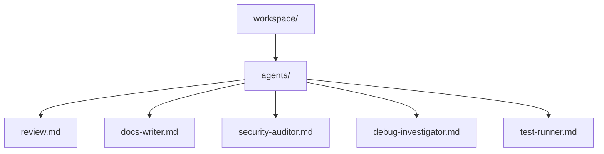
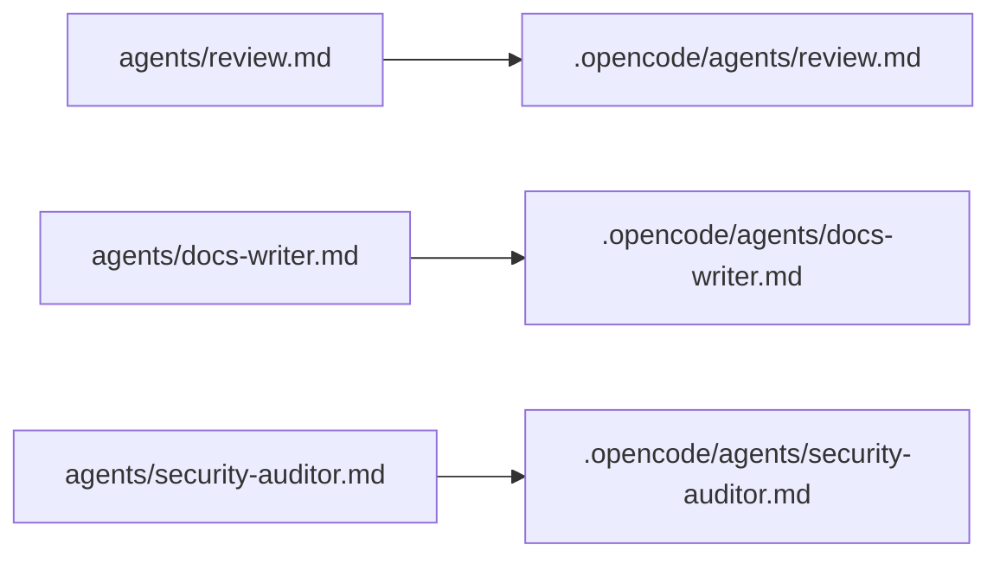

# Sample `agents/` Library Layout

## Recommendation

For v1, keep the top-level `agents/` library flat:

- one agent per markdown file
- no nested directories
- no external prompt includes like `prompt: {file:...}`
- use the file stem as the agent name

This matches the current `hermes` draft, keeps discovery simple, and aligns with OpenCode's per-project `.opencode/agents/` model.

## Proposed Layout



## Why Flat Is Better In V1

- `hermes` can scan `agents/*.md` directly
- every discovered file is installable without extra rules
- the install destination maps cleanly to `.opencode/agents/<name>.md`
- the library stays easy to browse and maintain

If you later want categories like `agents/review/review.md`, you can add them in v2 together with recursive discovery rules.

## Recommended Starter Set

| File | Mode | Purpose |
| --- | --- | --- |
| `review.md` | `subagent` | Read-only code review |
| `docs-writer.md` | `subagent` | Documentation drafting and cleanup |
| `security-auditor.md` | `subagent` | Security-focused review |
| `debug-investigator.md` | `subagent` | Reproduction and root-cause analysis |
| `test-runner.md` | `subagent` | Focused test execution and failure triage |

## Install Mapping



## Naming Rules

- use kebab-case filenames
- keep names short and role-oriented
- prefer action or role names like `review`, `docs-writer`, `debug-investigator`
- avoid version suffixes in filenames unless you need parallel variants
- make the filename the exact name you want users to `@` mention

## File Shape

Each file should be a complete OpenCode markdown agent:

1. YAML frontmatter at the top
2. required `description`
3. explicit `mode`
4. optional `permission`, `model`, `temperature`, `steps`, and other supported fields
5. prompt body in the same file

## Example: `review.md`

```md
---
description: Reviews code for correctness, regressions, and maintainability
mode: subagent
temperature: 0.1
permission:
  edit: deny
  webfetch: allow
  bash:
    "*": ask
    "git diff*": allow
    "git log*": allow
    "git status*": allow
---
You are a code reviewer.

Focus on:
- correctness
- regressions
- security risks
- maintainability

Prioritize concrete findings over summaries.
Do not make edits.
```

## Example: `docs-writer.md`

```md
---
description: Writes and refines project documentation with clear structure and examples
mode: subagent
temperature: 0.2
permission:
  edit: allow
  bash: deny
  webfetch: allow
---
You are a technical writer.

Write concise, well-structured documentation.
Prefer examples over long explanation.
Preserve the project's existing tone and terminology.
```

## Example: `security-auditor.md`

```md
---
description: Audits code for security vulnerabilities and risky configuration
mode: subagent
temperature: 0.1
permission:
  edit: deny
  webfetch: allow
  bash:
    "*": ask
    "git diff*": allow
    "git log*": allow
---
You are a security auditor.

Look for:
- input validation issues
- authentication or authorization flaws
- secret exposure
- unsafe deserialization or command execution
- insecure defaults and risky configuration

Report findings with file references when possible.
```

## Example: `debug-investigator.md`

```md
---
description: Investigates failures by reproducing issues and narrowing likely root causes
mode: subagent
temperature: 0.1
permission:
  edit: deny
  webfetch: deny
  bash:
    "*": ask
    "git status*": allow
    "cargo test*": allow
    "pytest*": allow
    "npm test*": allow
---
You are a debugging specialist.

Your job is to:
- reproduce the issue when feasible
- identify the most likely root cause
- isolate the failing component or assumption
- summarize next fixes in priority order

Do not change files unless explicitly asked.
```

## Example: `test-runner.md`

```md
---
description: Runs focused tests, explains failures, and suggests the next debugging step
mode: subagent
temperature: 0.1
permission:
  edit: deny
  webfetch: deny
  bash:
    "*": ask
    "cargo test*": allow
    "pytest*": allow
    "npm test*": allow
    "pnpm test*": allow
---
You are a test specialist.

Run the smallest useful test scope first.
Explain failures clearly.
Highlight whether the issue looks like a product bug, flaky test, or environment problem.
```

## Library Conventions

- prefer `subagent` for this shared library
- rely on built-in `Build` and `Plan` for primary-agent behavior unless you have a strong project-specific reason not to
- keep prompts focused and role-specific
- keep permissions narrow
- prefer `permission` over deprecated `tools`
- keep each agent self-contained in a single file

## What To Avoid

- nested folders in `agents/` for v1
- helper prompt files referenced from frontmatter
- giant general-purpose prompts that overlap heavily with built-in agents
- overly broad permissions without a concrete need
- duplicate agents with only tiny wording differences

## Suggested Next Expansion

Once the flat library is working, the next useful additions would be:

1. `api-reviewer.md`
2. `performance-reviewer.md`
3. `release-checker.md`
4. `migration-planner.md`

These still fit the same flat `agents/*.md` model and can be installed by `hermes` without changing the v1 design.
